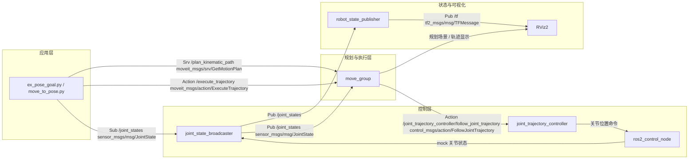

# MoveIt 末端位姿控制 — 数据流计算图

> **场景：** `ex_fake_control.launch.py`（RViz + mock 硬件）+ `ex_pose_goal.py` 末端位姿目标  
> **平台：** WSL2 Ubuntu 24.04 · ROS 2 Jazzy · Panda 代理（Phase 1）  
> **对应脚本：** [`scripts/wsl_launch_fake_control.sh`](../scripts/wsl_launch_fake_control.sh)、[`scripts/wsl_test_pose_goal.sh`](../scripts/wsl_test_pose_goal.sh)

本文档回答项管要求：**机械臂能动了之后，画出计算图，标出数据类型与数据方向**。

---

## 1. 场景说明

在 **fake control** 模式下，MoveIt 2 通过 `mock_components/GenericSystem` 模拟关节运动（无 Gazebo 物理）。用户在终端 2 运行 `ex_pose_goal.py`，传入末端目标位姿 `(x, y, z)` 与四元数 `quat_xyzw`；pymoveit2 先向 `move_group` **请求规划**，再 **请求执行** 关节轨迹；`move_group` 将轨迹下发给 `joint_trajectory_controller`，经 `ros2_control_node` 驱动 mock 关节；`joint_state_broadcaster` 将当前关节状态发布到 `/joint_states`，供规划器与 RViz 反馈使用。

> **Jazzy 注意：** launch 内 spawner 可能因竞态失败，需使用 [`wsl_launch_fake_control.sh`](../scripts/wsl_launch_fake_control.sh) 的 15 s 延迟后手动 spawn（见 [`scripts/README.md`](../scripts/README.md) 场景 2）。

---

## 2. 计算图（数据流）

下图展示 **pymoveit2 默认路径**（`use_move_group_action=False`，即 `ex_pose_goal.py` 的默认行为）：规划走 **Service**，执行走 **Action**。



**闭环反馈：** `/joint_states` 从 `joint_state_broadcaster` 发布，被 `move_group`（规划场景监视）、`robot_state_publisher`（TF 树）和 pymoveit2 客户端同时订阅。

---

## 3. 数据接口表

| 源节点 | 目标节点 | 通信方式 | 接口名 | 消息 / Service / Action 类型 | 数据内容 | 方向 |
|--------|----------|----------|--------|------------------------------|----------|------|
| `joint_state_broadcaster` | `ex_pose_goal` / `move_to_pose` | Topic | `/joint_states` | `sensor_msgs/msg/JointState` | 关节名、`position[]`、`velocity[]` | Pub → Sub |
| `ex_pose_goal` | `move_group` | **Service** | `/plan_kinematic_path` | `moveit_msgs/srv/GetMotionPlan` | 末端位姿约束、起始 `JointState`、规划组名 | Client → Server |
| `move_group` | `ex_pose_goal` | **Service 响应** | `/plan_kinematic_path` | `moveit_msgs/srv/GetMotionPlan` | `trajectory_msgs/JointTrajectory`（规划结果） | Server → Client |
| `ex_pose_goal` | `move_group` | **Action** | `/execute_trajectory` | `moveit_msgs/action/ExecuteTrajectory` | 待执行的 `JointTrajectory` | Client → Server |
| `move_group` | `joint_trajectory_controller` | **Action** | `/joint_trajectory_controller/follow_joint_trajectory` | `control_msgs/action/FollowJointTrajectory` | 关节轨迹 waypoints、时间戳 | Client → Server |
| `joint_trajectory_controller` | `ros2_control_node` | 内部接口 | — | `hardware_interface` | 关节位置命令 | 控制器 → 硬件 |
| `ros2_control_node` | `joint_state_broadcaster` | 内部接口 | — | `hardware_interface` | mock 关节读数 | 硬件 → 广播器 |
| `joint_state_broadcaster` | `move_group` | Topic | `/joint_states` | `sensor_msgs/msg/JointState` | 当前关节状态（闭环） | Pub → Sub |
| `joint_state_broadcaster` | `robot_state_publisher` | Topic | `/joint_states` | `sensor_msgs/msg/JointState` | 同上 | Pub → Sub |
| `robot_state_publisher` | `RViz2` | Topic | `/tf` | `tf2_msgs/msg/TFMessage` | 连杆位姿变换 | Pub → Sub |
| `move_group` | `RViz2` | Topic | `/display_planned_path` 等 | `moveit_msgs/msg/DisplayTrajectory` | 规划路径可视化 | Pub → Sub |

### 备选单步路径（未在默认 `ex_pose_goal` 中使用）

若设置 `use_move_group_action=True`，规划与执行合并为一步：

| 源节点 | 目标节点 | 通信方式 | 接口名 | 类型 | 方向 |
|--------|----------|----------|--------|------|------|
| `ex_pose_goal` | `move_group` | Action | `/move_action` | `moveit_msgs/action/MoveGroup` | Client → Server |

---

## 4. 应用层数据类型（Python → ROS）

[`src/moveit_ee_tutorial/move_to_pose.py`](../src/moveit_ee_tutorial/move_to_pose.py) 与 `ex_pose_goal.py` 在应用层的输入类型如下：

| 层级 | 变量 | Python 类型 | 含义 |
|------|------|-------------|------|
| 用户参数 | `position` | `list[float]` 长度 3 | 末端位置 `(x, y, z)` 米 |
| 用户参数 | `quat_xyzw` | `list[float]` 长度 4 | 末端姿态四元数 `(x, y, z, w)` |
| pymoveit2 内部 | `pose_stamped` | `geometry_msgs/PoseStamped` | `header.frame_id` = `panda_link0`；`pose.position` + `pose.orientation` |
| 规划请求 | `GetMotionPlan.Request` | MoveIt service 请求 | 含 `MotionPlanRequest`：规划组、`PositionConstraint`、`OrientationConstraint` |
| 规划响应 | `JointTrajectory` | `trajectory_msgs/JointTrajectory` | 7 个 `panda_joint1..7` 的轨迹点 |
| 执行请求 | `ExecuteTrajectory.Goal` | MoveIt action goal | 封装上述 `JointTrajectory` |

**数据流概括：**

```
list[float] position/quat_xyzw
    → geometry_msgs/PoseStamped
    → moveit_msgs/MotionPlanRequest (via /plan_kinematic_path)
    → trajectory_msgs/JointTrajectory
    → moveit_msgs/ExecuteTrajectory action goal
    → control_msgs/FollowJointTrajectory action goal
    → mock 关节 position 更新
    → sensor_msgs/JointState on /joint_states
```

---

## 5. 运行时节点列表

fake control 栈启动后，主要节点（详见 [`figures/week2_ros_nodes.txt`](figures/week2_ros_nodes.txt)）：

| 节点名 | 包 / 可执行文件 | 作用 |
|--------|-----------------|------|
| `/move_group` | `moveit_ros_move_group` | 运动规划、轨迹执行调度 |
| `/controller_manager` | `controller_manager/ros2_control_node` | mock 硬件 + 控制器管理 |
| `/robot_state_publisher` | `robot_state_publisher` | 根据 `/joint_states` 发布 TF |
| `/rviz2` | `rviz2` | 可视化 |
| `/ex_pose_goal` | `pymoveit2/ex_pose_goal.py` | 测试时临时出现 |

控制器（由 spawner 加载，见 [`controllers_position.yaml`](https://github.com/AndrejOrsula/panda_gz_moveit2)）：

- `joint_trajectory_controller` — 7-DOF 臂
- `joint_state_broadcaster` — 发布 `/joint_states`
- `gripper_trajectory_controller` — 夹爪（本场景未使用）

---

## 6. 复现步骤

**前置：** 已运行 [`scripts/wsl_setup_moveit.sh`](../scripts/wsl_setup_moveit.sh)。

**终端 1（WSL）：**

```bash
bash /mnt/d/Repository/internship_and_research/FURP-2025-ZifanXu-WholeBodyControl/scripts/wsl_launch_fake_control.sh
```

**终端 2（WSL）：**

```bash
bash /mnt/d/Repository/internship_and_research/FURP-2025-ZifanXu-WholeBodyControl/scripts/wsl_test_pose_goal.sh
```

**期望输出：** `Moving to {position: [0.25, 0.0, 1.0], quat_xyzw: [0.0, 0.0, 0.0, 1.0]}`；RViz 中 Panda 末端朝目标运动。

**自检命令（栈运行中）：**

```bash
ros2 node list
ros2 topic list -t | grep -E 'joint_states|tf'
ros2 action list -t | grep -E 'execute_trajectory|follow_joint_trajectory'
```

---

## 7. 附录

| 文件 | 说明 |
|------|------|
| [`figures/week2_ros_nodes.txt`](figures/week2_ros_nodes.txt) | 预期节点列表 |
| [`figures/week2_ros_topics.txt`](figures/week2_ros_topics.txt) | 主要 Topic 与类型 |
| [`figures/week2_ros_actions.txt`](figures/week2_ros_actions.txt) | Action / Service 接口 |
| [`scripts/README.md`](../scripts/README.md) | WSL 脚本场景说明 |
| pymoveit2 源码 | `~/ros2_ws/src/pymoveit2/pymoveit2/moveit2.py` — `plan_kinematic_path`、`execute_trajectory`、`joint_states` |
| panda 配置 | `~/ros2_ws/src/panda_gz_moveit2/panda_moveit_config/config/moveit_controller_manager.yaml` |

> **快照说明：** 2026-06-28 在 WSL 中尝试实时采集时，因系统未安装 `ros-jazzy-moveit`（`moveit_ros_move_group` not found），接口名根据上述源码与配置整理。栈正常运行后可用第 6 节命令生成 `*_live.txt` 对照验证。
